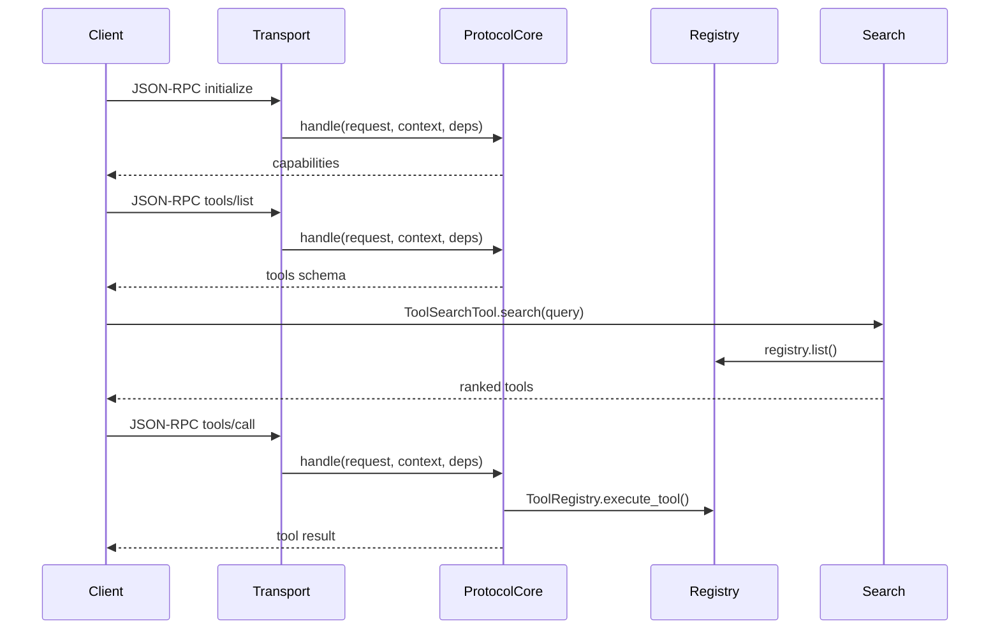

# Architecture Walkthrough

> 這份文件是「設計敘事 + 擴充指南」，不是 API 文件。每一章都對應至少一個**真實檔案路徑**與**真實符號**，方便你直接對照程式碼。

## Repo 定位與三類使用者

ToolAnything 的定位是「跨協議 AI 工具中介層」：一份工具定義可以輸出到 MCP 與 OpenAI Tool Calling。對應三類使用者：

1. **初學者**：只需要把 Python 函式變成可呼叫的工具。
2. **已有 MCP 概念者**：關注協議邊界、transport 與 protocol core 的責任切割。
3. **進階使用者**：需要搜尋、排序與策略化選擇工具。

**對照位置與符號**
- `src/toolanything/decorators/tool.py`：`tool()` decorator 是工具註冊入口。
- `src/toolanything/core/models.py`：`ToolSpec` 是工具描述的單一資料來源。

**最小概念示例**
```python
from toolanything.decorators import tool

@tool(name="quickstart.greet", description="打招呼")
def greet(name: str) -> str:
    return f"Hello {name}"
```

## 為什麼 protocol 要獨立（指出 protocol core 的入口與責任）

協議核心負責 JSON-RPC method routing、錯誤格式與回應包裝，避免每個 server/transport 重新實作 MCP method。

**對照位置與符號**
- `src/toolanything/protocol/mcp_jsonrpc.py`：`MCPJSONRPCProtocolCore.handle()` 是 method routing 的唯一入口。
- `src/toolanything/protocol/mcp_jsonrpc.py`：`MCPProtocolCoreImpl` 指向預設實作。

**責任重點**
- protocol core 處理 `initialize` / `tools/list` / `tools/call`。
- transport/server 只注入 capability、tool schema、tool invoker 與 context。

## 為什麼 server/transport 不知道 MCP method（指出 server 僅 I/O，method routing 在哪）

server/transport 只處理 I/O 與依賴注入，method routing 由 protocol core 統一處理。

**對照位置與符號**
- `src/toolanything/server/mcp_tool_server.py`：`MCPToolHandler.do_POST()` 將 request 轉交給 `protocol_core.handle(...)`。
- `src/toolanything/protocol/mcp_jsonrpc.py`：`MCPJSONRPCProtocolCore.handle()` 實際做 method routing。

**設計結果**
- 任何 transport（HTTP/SSE/stdio）都可共用同一份 MCP method 行為。
- server 只需關心如何讀/寫與 session context。

## 怎麼新增一個 transport（以現有 SSE/STDIO 對照，給出最小新增步驟）

新增 transport 的重點是：**I/O + 依賴注入 + MCPRequestContext**。

**對照位置與符號**
- `src/toolanything/server/mcp_tool_server.py`：`_build_handler()` 展示 HTTP/SSE 的依賴注入。
- `src/toolanything/server/mcp_stdio_server.py`：`MCPStdioServer.run()` 展示 stdio 讀寫。
- `src/toolanything/protocol/mcp_jsonrpc.py`：`MCPRequestContext`。

**最小新增步驟**
1. 建立新的 transport server（例如 `src/toolanything/server/mcp_websocket_server.py`）。
2. 建立 `_ProtocolDependencies`：capabilities/tools/invoker。
3. 將收到的 JSON-RPC request 交給 `MCPProtocolCoreImpl.handle(...)`。
4. 將 response（若非 `None`）回寫到 transport 的輸出通道。

## 怎麼新增一個 tool strategy（指出策略介面與預設策略，如何接到 ToolSearchTool/CLI）

搜尋策略負責「篩選 + 排序」，預設以 `RuleBasedStrategy` 執行（文字相似度 + metadata 條件）。

**對照位置與符號**
- `src/toolanything/core/selection_strategies.py`：`BaseToolSelectionStrategy`、`RuleBasedStrategy`。
- `src/toolanything/core/tool_search.py`：`ToolSearchTool` 注入策略。
- `src/toolanything/cli.py`：`_run_search()` 使用 `ToolSearchTool`。

**最小做法（自訂策略 → 注入 ToolSearchTool）**
```python
from toolanything.core.selection_strategies import BaseToolSelectionStrategy, SelectionOptions
from toolanything.core.tool_search import ToolSearchTool

class AlwaysFirstStrategy(BaseToolSelectionStrategy):
    def select(self, tools, *, options: SelectionOptions, failure_score, now=None):
        return list(tools)[: options.top_k]

searcher = ToolSearchTool(registry, failure_log, strategy=AlwaysFirstStrategy())
results = searcher.search(query="demo")
```

## Tool metadata 設計（cost/latency_hint_ms/side_effect/category/tags/extra）與向下相容策略

metadata 提供成本、延遲、副作用等訊號，讓搜尋可依條件篩選。未填 metadata 的舊工具仍可用，未知欄位會被保留在 `extra`。

**對照位置與符號**
- `src/toolanything/core/metadata.py`：`ToolMetadata`、`normalize_metadata()`。
- `src/toolanything/core/models.py`：`ToolSpec.normalized_metadata()`。
- `src/toolanything/core/selection_strategies.py`：`RuleBasedStrategy._filter_by_metadata()`。

**向下相容策略**
- 未提供欄位 → 以 `None` 視為「未知」，不會被硬性排除。
- 未知欄位 → `normalize_metadata()` 會留在 `extra`。

## End-to-end 流程（initialize → tools/list → tool search → tools/call）

以下用文字與 Mermaid 表示資料流，協議處理都集中在 `MCPJSONRPCProtocolCore.handle()`。

**對照位置與符號**
- `src/toolanything/protocol/mcp_jsonrpc.py`：`MCPJSONRPCProtocolCore.handle()`。
- `src/toolanything/core/tool_search.py`：`ToolSearchTool.search()`。
- `src/toolanything/core/registry.py`：`ToolRegistry.execute_tool()`。

**文字流程**
1. Client 發出 `initialize`。
2. Protocol core 透過 `MCPCapabilitiesProvider` 回傳能力資訊。
3. Client 呼叫 `tools/list`，protocol core 透過 `MCPToolSchemaProvider.list_tools()` 回傳工具清單。
4. 本地或外部工具搜尋（`ToolSearchTool.search()`）挑選候選工具。
5. Client 發出 `tools/call`，protocol core 透過 `MCPToolInvoker.call_tool()` 執行並回傳結果。



## 延伸閱讀

- `docs/README.md`
- `examples/quickstart/README.md`
