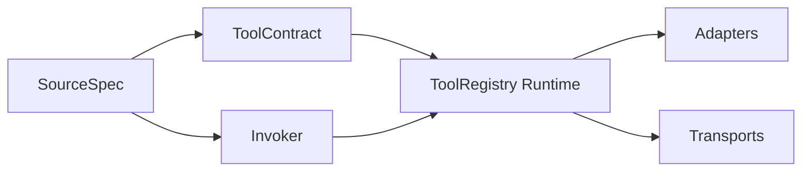
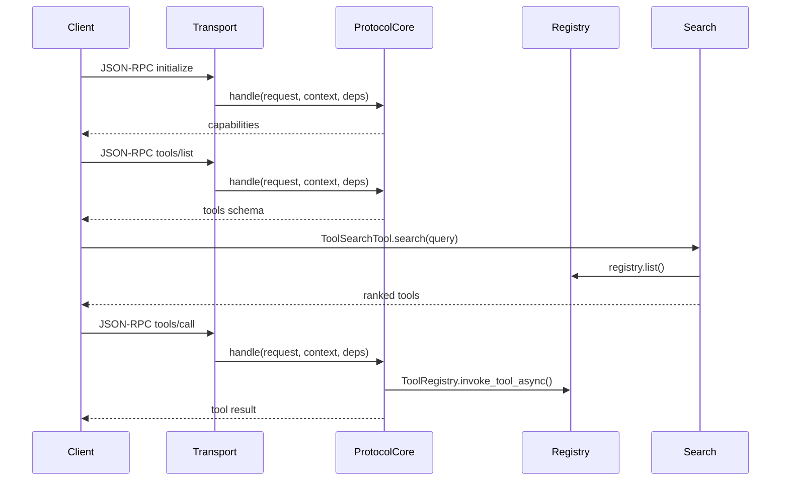

# Architecture Walkthrough

這是一份 explanation 文件，目標是讓你理解 ToolAnything 的分層、協議邊界與擴充點，而不是逐行講 API。

## Overview

這份架構說明回答的是：ToolAnything 為什麼這樣切層、這個 decision 帶來什麼好處，以及你未來應該把擴充點加在哪一層。

## Repo 定位

ToolAnything 的定位是「跨協議 AI 工具中介層」：一份工具定義可以輸出到 MCP 與 OpenAI tool calling。核心已從 callable-first 演進到 invoker-first，所以工具不一定綁定 Python function，也可以來自 HTTP、SQL 或 model inference source。

## 五層分工

1. `SourceSpec`：來源設定，例如 HTTP/SQL/model
2. `ToolContract`：工具名稱、描述、schema、metadata
3. `Invoker`：真正的執行邏輯
4. `Runtime`：建立執行上下文、查 invoker、維持相容 API
5. `Transport`：stdio、Streamable HTTP、legacy SSE/HTTP，只做 I/O

## 為什麼 protocol core 要獨立

協議核心負責 JSON-RPC method routing、錯誤格式與回應包裝，避免每一種 server/transport 都重寫一份 MCP method 行為。

這樣做的原因很直接：because MCP method 的語意應該被集中維護，而不是分散在 transport 內。

設計結果：

- `initialize`、`tools/list`、`tools/call` 的行為集中
- transport 只處理輸入、輸出、session 與依賴注入
- 新 transport 可以共用同一份 method routing

## 為什麼 server/transport 不知道 MCP method

因為 server 的職責不是決定協議語意，而是做 I/O。這樣分層後：

- Streamable HTTP、legacy SSE、stdio 可以共用核心協議行為
- protocol 變更不需要在每個 transport 各修一次
- 新增 transport 時，主要工作會回到「怎麼收 request / 怎麼送 response」

## Trade-offs

這個分層不是零成本，主要 trade-offs 包括：

- 初學者第一次看程式碼時，會感覺抽象層比單純 callable wrapper 多
- source、contract、invoker、runtime 分離後，學習曲線會比「一支 decorator 包到底」高
- 但換來的是協議演進、transport 擴充與相容層維護不會互相纏死

## 怎麼新增一個 transport

最小步驟：

1. 建立新的 transport server
2. 用 `build_protocol_dependencies(...)` 類似的 wiring 把 capability、schema provider、tool invoker 接進去
3. 把收到的 JSON-RPC request 交給 protocol core
4. 將非 `None` 的 response 回寫到 transport 輸出通道

重點是不要把 method routing 寫回 transport。

## 怎麼新增一種 source

最小步驟：

1. 定義新的 `SourceSpec`
2. 讓 schema compiler 能從來源設定產生 input schema
3. 實作對應 `Invoker`
4. 提供 register API，把來源編譯成正式工具

這也是為什麼 HTTP / SQL / model 工具可以被當成一級公民，而不是只能先包成 Python function。

## 工具搜尋策略

搜尋策略負責兩件事：

- 篩選
- 排序

預設會用 rule-based 路線，結合文字相似度與 metadata 條件。若你需要語意搜尋，repo 也已提供 `SemanticToolIndex` 與 `SemanticRetrievalStrategy` 這條路。

## metadata 的角色

metadata 不是裝飾品，而是平台級工具搜尋的訊號來源。常見欄位包括：

- `cost`
- `latency_hint_ms`
- `side_effect`
- `category`
- `tags`
- `extra`

向下相容策略：

- 未提供欄位時，以未知值處理，不會直接把舊工具排除
- 未知欄位會保留在 `extra`

## End-to-end 流程

1. Client 發出 `initialize`
2. protocol core 回傳 capabilities
3. Client 呼叫 `tools/list`
4. 搜尋層挑選候選工具
5. Client 發出 `tools/call`
6. registry / invoker 執行工具並回傳結果

## 當前建議

- 新的網路型整合：優先用 Streamable HTTP
- Desktop host：用 stdio
- 舊 client 相容：才用 legacy SSE/HTTP

## Limitations

目前文件與實作都明確排除這些範圍：

- skill as tool
- 完整 OpenAPI importer
- GraphQL source
- model training orchestration

## 相關文件

- [Tool Definition and Registration](Tool-Definition-and-Registration)
- [MCP Serving and Transports](MCP-Serving-and-Transports)
- [Migration Guide](Migration-Guide)
